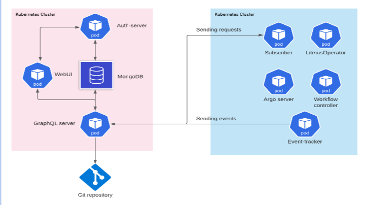
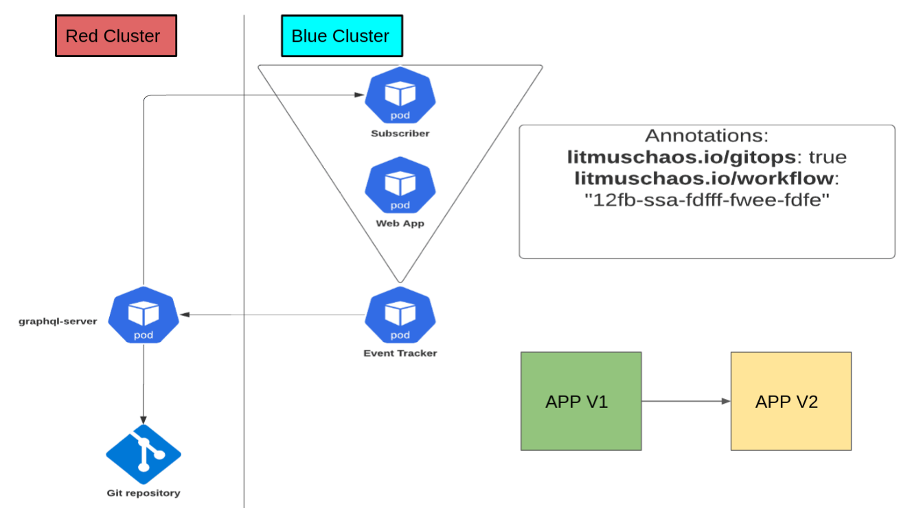

# LitmusChaos 클러스터 인프라 읽기

목표: 지금까지 배운 Kubernetes 기본 개념으로 LitmusChaos 구조도를 해석합니다.

이 문서는 LitmusChaos를 설치하거나 실행하기 위한 절차가 아닙니다. 설치는 다음 시간에 진행하고, 여기서는 그림에 보이는 Pod, Namespace, Service, GitOps 흐름을 Kubernetes 관점으로 읽는 데 집중합니다.

## 1. 전체 그림



그림은 크게 두 영역으로 볼 수 있습니다.

- 왼쪽 분홍색 영역: LitmusChaos 포털과 API가 동작하는 관리 영역
- 오른쪽 파란색 영역: Chaos workflow를 실행하고 이벤트를 수집하는 실행 영역

두 영역 모두 Kubernetes Cluster 안에서 Pod로 실행됩니다. 그림의 육각형 `pod` 아이콘은 각각 Kubernetes Pod를 의미합니다.

## 2. Pod 관점으로 보기

그림에 보이는 주요 Pod는 다음과 같습니다.

| Pod | 역할 |
| --- | --- |
| WebUI | 사용자가 LitmusChaos를 조작하는 웹 화면 |
| Auth-server | 사용자 인증과 권한 처리를 담당 |
| GraphQL server | WebUI와 내부 컴포넌트 사이 API 역할 |
| Subscriber | 요청을 받아 실행 클러스터 쪽으로 전달 |
| LitmusOperator | Chaos 관련 Kubernetes 리소스를 보고 실제 실험 실행을 조정 |
| Argo server | Workflow 실행 상태를 관리하거나 조회하는 컴포넌트 |
| Workflow controller | Chaos workflow를 실제 Kubernetes 작업으로 실행 |
| Event-tracker | 실험 실행 중 발생하는 이벤트를 수집하고 GraphQL server 쪽으로 전달 |

여기서 중요한 점은 LitmusChaos도 결국 여러 개의 애플리케이션 Pod 묶음이라는 것입니다. 우리가 앞에서 배운 `nginx` Pod와 원리는 같습니다. 다만 역할이 더 많고, 서로 통신하며 하나의 플랫폼처럼 동작합니다.

## 3. Namespace 관점으로 보기

그림에는 namespace 이름이 직접 쓰여 있지 않지만, 실제 설치에서는 Litmus 관련 리소스를 보통 별도 namespace에 배치합니다.

예:

```bash
kubectl create namespace litmus
```

Namespace를 나누는 이유:

- Litmus 포털, operator, workflow 관련 Pod를 일반 애플리케이션과 분리해서 관리합니다.
- `kubectl get pods -n litmus`처럼 Litmus 관련 Pod만 따로 볼 수 있습니다.
- RBAC 권한을 Litmus namespace와 실험 대상 namespace 기준으로 나눌 수 있습니다.
- ResourceQuota나 LimitRange를 적용하면 Litmus가 사용할 수 있는 CPU/RAM 범위를 namespace 단위로 제한할 수 있습니다.

주의할 점:

- Namespace는 CPU/RAM을 자동으로 물리 분리하지 않습니다.
- CPU/RAM 제한은 `resources.requests`, `resources.limits`, `ResourceQuota`, `LimitRange`로 따로 설정해야 합니다.

## 4. Service 관점으로 보기

그림에는 Service 아이콘이 직접 보이지 않지만, Pod끼리 안정적으로 통신하려면 보통 Service가 필요합니다.

예를 들어 WebUI가 GraphQL server와 통신한다고 가정하면, WebUI가 GraphQL Pod IP에 직접 붙는 구조는 좋지 않습니다. Pod는 재시작되면 IP가 바뀔 수 있기 때문입니다.

일반적인 구조:

```text
WebUI Pod -> GraphQL Service -> GraphQL server Pod
```

Service가 필요한 이유:

- Pod IP가 바뀌어도 고정된 이름으로 접근할 수 있습니다.
- 여러 Pod replica가 있을 경우 트래픽을 분산할 수 있습니다.
- 클러스터 내부 통신은 `ClusterIP` Service로 안정화할 수 있습니다.
- WebUI처럼 사용자가 브라우저로 접근해야 하는 컴포넌트는 `NodePort`, `LoadBalancer`, Ingress 같은 외부 노출 방식이 필요할 수 있습니다.

## 5. Deployment 관점으로 보기

그림에는 Deployment가 직접 표시되어 있지 않지만, 실제로는 대부분의 서버형 컴포넌트가 Deployment로 관리됩니다.

예상되는 관계:

```text
Deployment/webui
  -> ReplicaSet
    -> WebUI Pod

Deployment/graphql-server
  -> ReplicaSet
    -> GraphQL server Pod

Deployment/auth-server
  -> ReplicaSet
    -> Auth-server Pod
```

Deployment를 쓰는 이유:

- Pod가 죽으면 새 Pod를 만들어 복구합니다.
- replica 수를 조정할 수 있습니다.
- 이미지 버전을 바꿀 때 rolling update를 수행할 수 있습니다.
- 문제가 생기면 rollback할 수 있습니다.

즉 그림의 Pod는 직접 손으로 띄운 Pod라기보다, 대부분 Deployment나 StatefulSet 같은 상위 리소스가 만든 Pod라고 보는 것이 자연스럽습니다.

## 6. MongoDB 관점으로 보기

왼쪽 그림에는 MongoDB가 있습니다.

MongoDB는 LitmusChaos가 사용자 정보, 프로젝트, 실험 메타데이터 같은 상태 정보를 저장하는 데이터 저장소 역할로 볼 수 있습니다.

Pod와 다른 점:

- WebUI나 GraphQL server는 stateless에 가깝습니다. 죽어도 새 Pod가 뜨면 동작을 이어갈 수 있습니다.
- MongoDB는 stateful합니다. 데이터가 사라지면 포털의 상태 정보가 유실될 수 있습니다.

따라서 MongoDB는 일반적으로 다음 개념과 연결됩니다.

- PersistentVolumeClaim: 데이터를 저장할 디스크 요청
- PersistentVolume: 실제 저장 공간
- Secret: DB 계정이나 비밀번호
- Service: 다른 Pod가 MongoDB에 접속하기 위한 고정 주소

이번 기본 실습에서는 PersistentVolume을 깊게 다루지 않지만, Litmus 구조를 이해할 때 MongoDB는 "Pod 안에 떠 있지만 데이터 보존이 중요한 컴포넌트"라고 보면 됩니다.

## 7. Git repository와 GitOps 흐름

그림 아래에는 Git repository가 있습니다.

LitmusChaos는 실험 정의나 workflow 상태를 Git repository와 연결해서 관리할 수 있습니다. 이때 Git은 단순 코드 저장소가 아니라, "어떤 실험을 어떤 클러스터에 적용할지"를 기록하는 선언형 저장소 역할을 합니다.

GitOps 관점의 흐름:

```text
사용자 또는 시스템이 실험 정의 작성
-> Git repository에 저장
-> Subscriber 또는 관련 컴포넌트가 변경 사항 감지
-> 실행 클러스터에 Chaos workflow 적용
-> Event-tracker가 실행 이벤트 수집
-> GraphQL server를 통해 WebUI에 결과 표시
```

여기서 Git repository는 Kubernetes 리소스는 아닙니다. 하지만 Kubernetes에 적용할 YAML 또는 workflow 정의의 source of truth 역할을 합니다.

## 8. Red Cluster와 Blue Cluster 그림



두 번째 그림은 클러스터가 둘로 나뉜 구조를 보여줍니다.

- Red Cluster: Litmus 관리 컴포넌트 또는 GitOps 제어 흐름이 있는 클러스터
- Blue Cluster: 실제 애플리케이션과 chaos 실행 컴포넌트가 있는 대상 클러스터

그림 기준으로 보면 Red Cluster의 `graphql-server`가 Git repository와 연결되고, Blue Cluster 쪽에는 `Subscriber`, `Web App`, `Event Tracker` Pod가 있습니다.

이 구조의 핵심은 관리 영역과 실험 대상 영역이 분리될 수 있다는 점입니다.

## 9. Blue Cluster 안의 Pod 해석

Blue Cluster에는 다음 Pod가 보입니다.

```text
Subscriber
Web App
Event Tracker
```

각 역할:

- `Web App`: chaos 실험 대상 애플리케이션입니다. 그림 오른쪽의 `APP V1 -> APP V2`는 애플리케이션이 새 버전으로 배포되는 상황을 의미합니다.
- `Subscriber`: Red Cluster나 GitOps 쪽에서 전달된 실험 요청을 받아 Blue Cluster 안에서 실행되도록 연결합니다.
- `Event Tracker`: Blue Cluster에서 발생한 실험 이벤트를 수집하고 Red Cluster 쪽 GraphQL server로 보냅니다.

Kubernetes 기본 개념으로 다시 쓰면:

```text
Blue Cluster
  ├─ Pod/Deployment: Web App
  ├─ Pod/Deployment: Subscriber
  └─ Pod/Deployment: Event Tracker
```

실제 운영에서는 각 Pod 앞에 Service, ServiceAccount, Role/RoleBinding, ConfigMap, Secret이 함께 존재할 가능성이 높습니다.

## 10. Annotation 해석

두 번째 그림에는 다음 annotation이 있습니다.

```yaml
annotations:
  litmuschaos.io/gitops: "true"
  litmuschaos.io/workflow: "12fb-ssa-fdfff-fwee-fdfe"
```

Annotation은 Kubernetes object에 붙이는 메타데이터입니다. Label이 selector로 리소스를 찾는 데 자주 쓰인다면, Annotation은 도구가 참고할 부가 정보를 저장하는 데 자주 씁니다.

이 annotation의 의미:

- `litmuschaos.io/gitops: "true"`: 이 리소스가 GitOps 흐름과 연결되어 있음을 나타냅니다.
- `litmuschaos.io/workflow`: 어떤 Litmus workflow와 관련된 리소스인지 식별하는 값입니다.

중요한 차이:

- Label: `app=web`처럼 Service나 Deployment selector가 대상을 찾는 데 사용
- Annotation: GitOps 여부, workflow id, 설명, 체크섬 같은 부가 정보 저장에 사용

## 11. 요청과 이벤트 흐름

그림의 화살표를 단순화하면 다음과 같습니다.

```text
WebUI
  -> GraphQL server
  -> Subscriber
  -> Workflow controller / LitmusOperator
  -> 대상 Web App에 chaos 주입
  -> Event Tracker
  -> GraphQL server
  -> WebUI에서 결과 확인
```

앞에서 배운 개념으로 보면:

- 요청을 보내는 것도 Pod입니다.
- 요청을 받는 것도 Pod입니다.
- Pod끼리 안정적으로 통신하려면 Service가 필요합니다.
- 어떤 Pod에 실험을 적용할지는 label/selector 또는 Litmus 리소스 설정으로 결정됩니다.
- 실험 결과는 Event Tracker와 GraphQL server를 통해 다시 사용자에게 표시됩니다.

## 12. Pod Delete Chaos를 이 구조에 대입하기

우리가 이번 시간에 수동으로 해보는 실험은 다음 명령입니다.

```bash
kubectl delete pod <target-pod>
```

LitmusChaos를 쓰면 같은 개념이 다음처럼 바뀝니다.

```text
사람이 직접 kubectl delete pod 실행
  -> Litmus workflow가 pod-delete 실험으로 자동 실행
```

수동 실험:

```text
사용자 -> kubectl -> Kubernetes API -> 대상 Pod 삭제
```

Litmus 실험:

```text
사용자 -> WebUI/GraphQL -> Litmus workflow -> Kubernetes API -> 대상 Pod 삭제
```

결국 삭제되는 것은 동일하게 대상 애플리케이션의 Pod입니다. 차이는 Litmus가 실험 정의, 실행, 이벤트 수집, 결과 기록을 자동화한다는 점입니다.

## 13. 지금까지 배운 개념으로 점검하기

그림을 볼 때 아래 질문을 던지면 구조를 더 잘 이해할 수 있습니다.

- 이 Pod는 어떤 역할인가?
- 이 Pod는 직접 만든 Pod인가, Deployment가 관리하는 Pod인가?
- 이 Pod는 어느 namespace에 있을까?
- 다른 Pod가 이 Pod에 접근할 때 Service를 사용할까?
- 이 컴포넌트는 stateless인가, stateful인가?
- Secret이나 ConfigMap이 필요할까?
- 어떤 리소스에 label이 붙고, 어떤 도구가 annotation을 읽을까?
- chaos 실험 대상은 Litmus 컴포넌트인가, 실제 애플리케이션 Pod인가?
